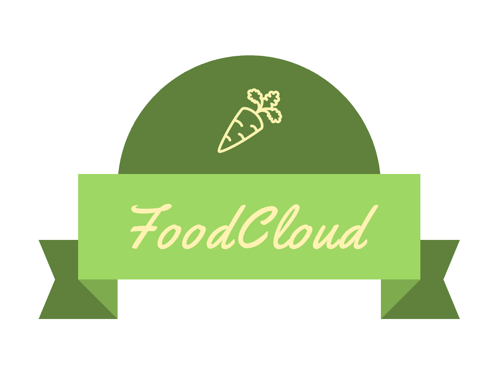

# Food Cloud: A Food Wastage Reduction App

Food Cloud is an android mobile application that allows users to donate food items, and to request donated food items. Users register as either donors or receivers and can accordingly access different features of the application. It was developed using [Kotlin](https://kotlinlang.org/) and [Firebase Database](https://firebase.google.com/).

## The Scope of the App

The environment of the application is divided among:
-	Donors: they can add items to the dashboard, view all the items they donated, and view their profile. They can also edit their personal information such as their password.
- Receivers: they can view the list of available items, request an item, view all the requested items, and view their profile. In the profile page they can edit their personal information (phone number).

## Accompanying App

[Food Cloud Admin](https://pages.github.com/) is an accompanying application used by the app admins to manage the orders.
